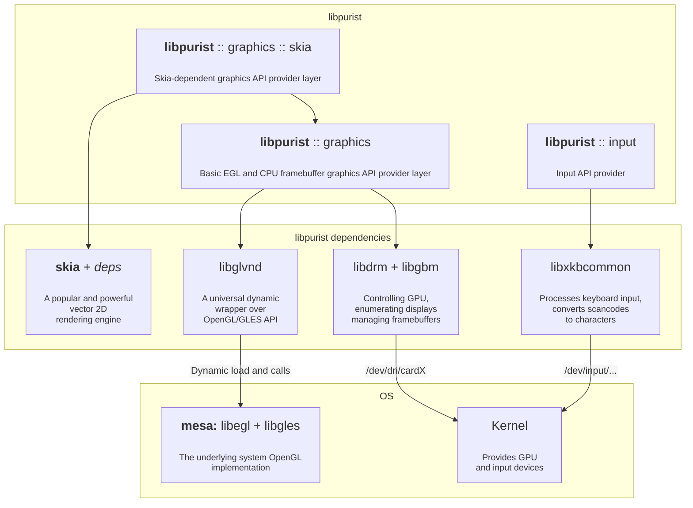

# libpurist

A slim bare-linux (using no Xorg/Wayland) graphics input/output framework designed to be easy, transparent and portable. That includes binary portability of the user applications.

The main features supported so far:

* Dynamic displays connection/disconnection
* Both OpenGL and CPU rasterization
* Plain graphics framebuffer output over `kmsdrm` (check `blinking_screen` example)
* Multilingual text input using `xkbcommon` library (check `text_input_skia` example)
* Advanced vector graphics rendering with `skia` (check any `*_skia` examples)

The library is an ideal backend to build swift and graphically-rich applications for low-end systems like ARM64 single board computers. Tested thoroughly on:

* Raspberry Pi 4
* Banana Pi BPI-M7
* Intel Core i7-1065G7 CPU laptop

At every system of the listed above the library takes minimal resources, utilizes less than 5% of a single CPU core (in idle) and allows rendering of a UHD 3840x2160 @ 60 FPS (or multiple FullHD displays at once).

## General architecture
This is the general architecture diagram of libpurist library. 

The library consists of 3 top-level components that the user should interact with:

* **purist :: graphics** — Basic graphics API. Supports both GPU-backed GL rendering and CPU-backed pixel-wise framebuffer operation. Leaves all the details to the user. Use this one:
    - if you need direct FB access
    - if you brought your own GL-based rendering system
    - if you make an application for an extremely weak system that doesn't support Skia

* **purist :: graphics :: skia** — Skia-based wrapper around the aforementioned API. Provides easy, precise and effective 2D vector graphics rendering. Use this in most cases. 

* **purist :: input** — A keyboard input-processing API. Provides both scancode-based key handlers and advanced locale-based character handler.

## End-user requirements
To run any `libpurist`-based application (including the provided examples), the user has to be in two groups: `input` and `video`. To add them to these groups, do:

    $ sudo usermod -a -G input,video <username>

## Dependencies

These packages have to be installed for the building to succeed

    $ sudo apt install --no-install-recommends cmake libtool-bin libfreetype-dev libfontconfig-dev libegl-dev libgles-dev libjpeg-dev libwebp-dev libxkbcommon-dev libgbm-dev libdrm-dev libevdev-dev
