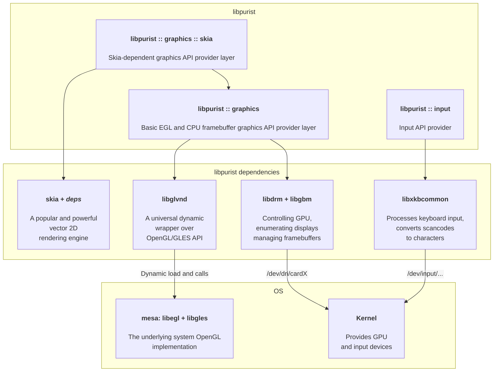

# libpurist

A slim bare-linux (no XOrg/Wayland) graphics input/output library designed to be easy, transparent and portable. That includes binary portability of the user applivcations.

The main features supported so far:

* Dynamic displays connection/disconnection
* Multilingual text input (using `xkbcommon` library, check `text_input_skia` example)
* Plain graphics framebuffer output over `kmsdrm` (check `blinking_screen` example)
* Both OpenGL and CPU rasterization
* Vector graphics rendering with `skia` (check `term_skia` and `text_input_skia` examples)

## General architecture
This is the general architecture diagram of libpurist library.

## User requirements
To run the `libpurist` examples the user has to be in two groups: `input` and `video`

    $ sudo usermod -a -G input,video <username>

## Dependencies

These packages have to be installed for the building to succeed

    $ sudo apt install --no-install-recommends cmake libtool-bin libfreetype-dev libfontconfig-dev libegl-dev libgles-dev libjpeg-dev libwebp-dev libxkbcommon-dev libgbm-dev libdrm-dev libevdev-dev
